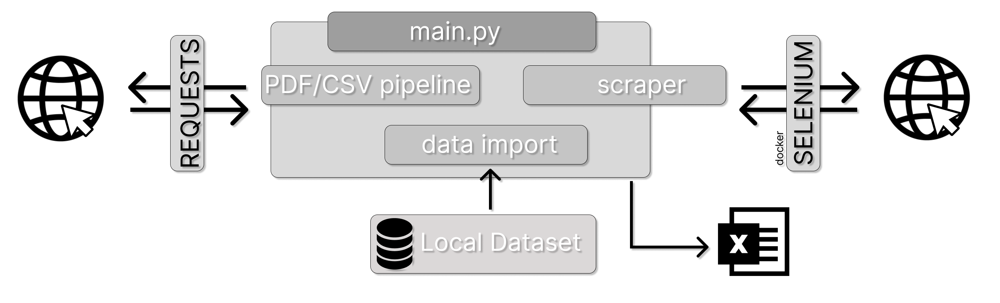

# Think Tanks investigation data
Goal:
Get all Think Tanks that have been active in the past five years.

Criteriums:
- Declared in the past five years.
- Had a meeting with the commission in the past five years.
- Had a meeting with the parliament in the pas five years.

Include in the dataset:
1. EU Transparency ID 
2. Name 
3. Date Registered 
4. Website 
5. Form of entity
6. Meetings with the parliament
7. Meeting with the commission



## Usage

### Download the Transparency Dataset
We use the ID already available in this dataset.
```
wget 'http://data.europa.eu/euodp/en/data/storage/f/2024-07-03T094150/ODP_30-06-2024.xml'
python -m xmljson 'ODP_30-06-2024.xml' -o 'transparency.json'
```
### Docker for scraping
```
docker run -d -p 4444:4444 -p 7900:7900 --shm-size="2g" selenium/standalone-chrome:latest
```
### Code
1. An API key to Webshare proxy needs to be added in scraper.py
2. Change the path of the json file imported in load_ID in main.py
```
pip install -r requirements.py
python main.py
```
